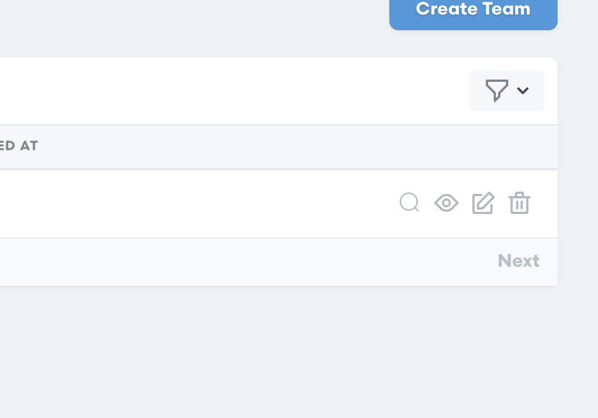
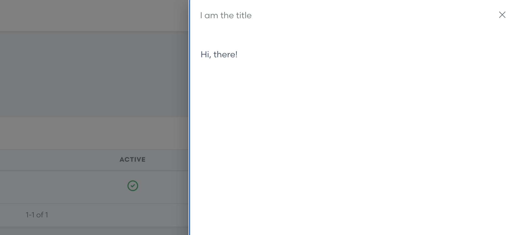
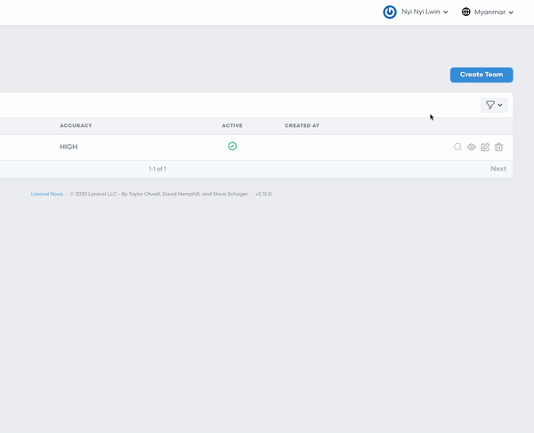

# Nova Quick View
[](https://packagist.org/packages/php-junior/nova-quick-view)
[](https://packagist.org/packages/php-junior/nova-quick-view)





## Installation
You can install the package in to a Laravel app that uses [Nova](https://nova.laravel.com) via composer:

```bash
composer require php-junior/nova-quick-view
```

## Usage
Add the following code :

```php
public function fields(Request $request)
{
    return [
        ...
        NovaQuickView::make('Hello', function () {
            return '<p>Hi, there!</p>';
        })
        ->icon('el-icon-search')
        ->title('I am the title')
        ->direction('rtl') rtl / ltr / ttb / btt
        ...
    ];
}
```

If you need to render HTML content :
```php
public function fields(Request $request)
{
    return [
        ...
        NovaQuickView::make('Hello', function () {
            return view('partials.hello', [
                'text' => 'Hi, there!'
            ])->render();
        })
        ->icon('el-icon-search')
        ->title('I am the title')
        ->direction('rtl') // rtl / ltr / ttb / btt
        ...
    ];
}
```
Please check icon list from [element](https://element.eleme.io/#/en-US/component/icon).
If you want to use fontawesome or others, import CSS file in `layout.blade.php` 

## Credits
- All Contributors

## License
The MIT License (MIT). Please see [License File](LICENSE) for more information.
